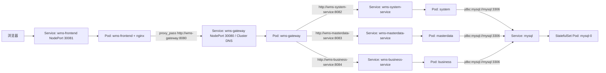

# Kubernetes Service 发现与 WMS 全链路调用指南

更新时间：2026-06-09

项目路径：

```text
D:\projects\wms-springcloud
```

本文回答三个问题：

1. 原来通过 Eureka discovery 发现服务，部署到 Kubernetes 后为什么会改为通过 Service 发现。
2. 如果部署到 Kubernetes 时使用 Service，各个服务是怎么发送请求的，用的是什么技术。
3. 从浏览器到前端 nginx、网关、业务服务、MySQL 的完整链路，以及每个配置文件具体做了什么。

## 1. 总体结论

WMS 现在保留了 Eureka 模块 `wms-discovery`，但在 Kubernetes 部署模式下，真正的业务流量不再依赖 Eureka 做服务发现。

关键切换点在两个地方：

```text
wms-gateway/src/main/resources/application.yml
deploy/helm/wms/templates/gateway.yaml
```

网关原配置：

```yaml
uri: ${WMS_SYSTEM_SERVICE_URI:lb://wms-system-service}
uri: ${WMS_MASTERDATA_SERVICE_URI:lb://wms-masterdata-service}
uri: ${WMS_BUSINESS_SERVICE_URI:lb://wms-business-service}
```

含义是：

- 如果没有环境变量 `WMS_SYSTEM_SERVICE_URI`，默认使用 `lb://wms-system-service`。
- `lb://` 是 Spring Cloud Gateway + Spring Cloud LoadBalancer 的写法，通常结合 Eureka 中的服务实例列表选择目标服务。
- 如果环境变量存在，就使用环境变量里的真实 HTTP 地址。

Kubernetes Helm 部署时，在 `deploy/helm/wms/templates/gateway.yaml` 给网关注入了这些环境变量：

```yaml
- name: EUREKA_CLIENT_ENABLED
  value: "false"
- name: WMS_SYSTEM_SERVICE_URI
  value: http://wms-system-service:8082
- name: WMS_MASTERDATA_SERVICE_URI
  value: http://wms-masterdata-service:8083
- name: WMS_BUSINESS_SERVICE_URI
  value: http://wms-business-service:8084
```

所以 Kubernetes 中的实际路由变成：

```text
/api/auth/**          -> http://wms-system-service:8082
/api/menus/**         -> http://wms-system-service:8082
/api/users/**         -> http://wms-system-service:8082
/api/roles/**         -> http://wms-system-service:8082
/api/config-items/**  -> http://wms-system-service:8082

/api/suppliers/**     -> http://wms-masterdata-service:8083
/api/customers/**     -> http://wms-masterdata-service:8083
/api/equipment/**     -> http://wms-masterdata-service:8083
/api/parts/**         -> http://wms-masterdata-service:8083
/api/locations/**     -> http://wms-masterdata-service:8083

/api/inbound-orders/** -> http://wms-business-service:8084
/api/outbound-orders/** -> http://wms-business-service:8084
/api/kanbans/**       -> http://wms-business-service:8084
/api/inventory/**     -> http://wms-business-service:8084
/api/mobile/scan/**   -> http://wms-business-service:8084
```

也就是说：不是业务代码里到处改调用地址，而是网关配置支持“本地默认 Eureka / Kubernetes 覆盖为 Service 地址”。

## 2. 本地模式和 Kubernetes 模式的区别

### 2.1 本地或普通 Spring Cloud 模式

本地服务配置里仍然存在 Eureka 地址：

```text
wms-gateway/src/main/resources/application.yml
wms-system-service/src/main/resources/application.yml
wms-masterdata-service/src/main/resources/application.yml
wms-business-service/src/main/resources/application.yml
```

例如：

```yaml
eureka:
  client:
    service-url:
      defaultZone: http://127.0.0.1:8761/eureka/
```

网关路由默认值是：

```yaml
uri: ${WMS_SYSTEM_SERVICE_URI:lb://wms-system-service}
```

如果没有 `WMS_SYSTEM_SERVICE_URI`，Spring Cloud Gateway 会使用 `lb://wms-system-service`。

这个模式下大致链路是：

```text
服务启动 -> 注册到 Eureka -> 网关通过 lb:// 服务名找实例 -> 转发 HTTP 请求
```

### 2.2 Kubernetes 模式

Kubernetes 部署时，Helm 模板给服务注入：

```yaml
EUREKA_CLIENT_ENABLED=false
```

这个环境变量会被 Spring Boot 解析为：

```yaml
eureka.client.enabled=false
```

所以服务在 Kubernetes 下不会把 Eureka 当成业务流量发现机制。

网关同时被注入：

```yaml
WMS_SYSTEM_SERVICE_URI=http://wms-system-service:8082
WMS_MASTERDATA_SERVICE_URI=http://wms-masterdata-service:8083
WMS_BUSINESS_SERVICE_URI=http://wms-business-service:8084
```

Spring Boot 环境变量优先级高于 `application.yml` 中 `${变量名:默认值}` 的默认值，因此网关最终拿到的是 Kubernetes Service 地址，而不是 `lb://` 地址。

这个模式下大致链路是：

```text
服务 Pod 启动
Kubernetes Service 通过 selector 找到对应 Pod
CoreDNS 解析 wms-system-service / wms-masterdata-service / wms-business-service
网关用 HTTP 请求 Service 名称
Service 再负载转发到后端 Pod
```

## 3. Kubernetes 下服务之间通过什么技术通信

当前项目里没有发现业务服务之间直接使用 `Feign`、`RestTemplate`、`WebClient` 的代码调用。

实际业务 HTTP 调用主要发生在：

```text
浏览器 -> 前端 nginx -> wms-gateway -> 后端业务服务
```

其中：

- 浏览器使用 `fetch`，代码在 `frontend/src/api/client.ts`。
- 前端容器里的 nginx 使用反向代理，配置在 `deploy/docker/nginx.conf`。
- 网关使用 Spring Cloud Gateway WebFlux，底层是响应式 HTTP 转发。
- Kubernetes 内部服务发现使用 Kubernetes Service + CoreDNS + kube-proxy 或 CNI 的服务转发能力。
- 后端服务访问 MySQL 使用 JDBC，数据库地址也是 Kubernetes Service 名称 `mysql`。

如果后续某个业务服务需要直接调用另一个业务服务，可以用普通 HTTP 客户端：

```text
http://wms-masterdata-service:8083/api/parts
```

可选技术：

- Spring WebClient
- RestTemplate
- OpenFeign

在 Kubernetes 中，不需要这些客户端认识 Pod IP，也不需要它们自己连 Eureka。它们只要访问 Service DNS 名称即可。

## 4. Kubernetes 为什么能通过 Service 名称访问别人

以 `wms-system-service` 为例，Helm 模板在 `deploy/helm/wms/templates/system-service.yaml` 创建了两个资源。

第一个是 Service：

```yaml
apiVersion: v1
kind: Service
metadata:
  name: wms-system-service
spec:
  ports:
    - name: http
      port: 8082
      targetPort: 8082
  selector:
    app: wms-system-service
```

第二个是 Deployment，其中 Pod 带有同样的 label：

```yaml
template:
  metadata:
    labels:
      app: wms-system-service
```

Kubernetes 根据这两个配置做了几件事：

1. Service `wms-system-service` 根据 selector `app=wms-system-service` 找到匹配的 Pod。
2. Kubernetes 维护 EndpointSlice，里面记录 Service 后面有哪些 Pod IP 和端口。
3. CoreDNS 为 Service 创建集群内 DNS 名称。
4. Pod 内部的 `/etc/resolv.conf` 会包含集群 DNS nameserver 和 search domain。
5. 同一个 namespace 下，Pod 访问短名称 `wms-system-service` 时，会自动补全为类似：

```text
wms-system-service.wms.svc.cluster.local
```

6. kube-proxy 或集群 CNI 根据 Service 的虚拟 IP，把流量转发到真实 Pod IP。

所以网关访问：

```text
http://wms-system-service:8082
```

不是访问某个固定 Pod，而是访问 Kubernetes Service。后面 Pod 替换、重启、IP 改变时，Service 名称仍然不变。

## 5. Kubernetes 会给 Pod 注入或配置什么

部署到 Kubernetes 后，Pod 能通过 Service 访问别人，主要依赖以下内容。

### 5.1 DNS 配置

Kubernetes 会给 Pod 写入 DNS 配置，通常可以这样查看：

```powershell
kubectl exec -n wms deploy/wms-gateway -- cat /etc/resolv.conf
```

一般会看到类似内容：

```text
nameserver 10.x.x.x
search wms.svc.cluster.local svc.cluster.local cluster.local
options ndots:5
```

这里的 `nameserver` 指向集群 DNS，也就是 CoreDNS。

`search wms.svc.cluster.local` 让 Pod 在同一个 namespace 中可以直接使用短名称：

```text
wms-gateway
wms-system-service
wms-masterdata-service
wms-business-service
mysql
```

### 5.2 Service 环境变量

Kubernetes 也会给 Pod 注入一些 Service 相关环境变量，例如：

```text
WMS_GATEWAY_SERVICE_HOST
WMS_GATEWAY_SERVICE_PORT
MYSQL_SERVICE_HOST
MYSQL_SERVICE_PORT
```

但是本项目没有依赖这些自动注入的 Service 环境变量做业务路由。

本项目使用的是更清晰的方式：在 Helm Deployment 模板里主动声明环境变量：

```yaml
WMS_SYSTEM_SERVICE_URI=http://wms-system-service:8082
DB_URL=jdbc:mysql://mysql:3306/wms_cloud...
```

这样配置更直观，也更容易排查。

### 5.3 Secret 注入

MySQL 用户名和密码通过 Secret 注入。

文件：

```text
deploy/helm/wms/templates/secret.yaml
```

服务模板中这样使用：

```yaml
- name: DB_USERNAME
  valueFrom:
    secretKeyRef:
      name: wms-mysql-secret
      key: username
- name: DB_PASSWORD
  valueFrom:
    secretKeyRef:
      name: wms-mysql-secret
      key: password
```

### 5.4 ConfigMap 注入

初始化 SQL 通过 ConfigMap 注入。

文件：

```text
deploy/helm/wms/templates/mysql-init-configmap.yaml
```

内容来自：

```text
deploy/helm/wms/files/wms-cloud-init.sql
```

MySQL Pod 和初始化 Job 都可以挂载这个 ConfigMap。

## 6. 前端到后端的完整链路

### 6.1 浏览器访问前端 NodePort

Helm 文件：

```text
deploy/helm/wms/templates/frontend.yaml
```

Service：

```yaml
kind: Service
metadata:
  name: wms-frontend
spec:
  type: NodePort
  ports:
    - port: 80
      targetPort: 80
      nodePort: 30081
```

浏览器访问：

```text
http://127.0.0.1:30081
```

云服务器访问：

```text
http://8.138.198.245:30081
```

### 6.2 前端 API 使用同源 `/api`

前端 API 基础地址：

```text
frontend/src/api/client.ts
```

关键代码：

```ts
const API_BASE = import.meta.env.VITE_API_BASE ?? 'http://127.0.0.1:8080/api'
```

GitHub Actions 构建前端镜像时注入：

```yaml
build_args: |
  VITE_API_BASE=/api
```

所以部署到 Kubernetes 后，浏览器实际请求：

```text
http://127.0.0.1:30081/api/auth/login
```

注意：浏览器不能解析 Kubernetes 内部的 `wms-gateway` Service 名称。浏览器只访问前端 NodePort，Service 名称解析发生在集群内部的前端 nginx Pod 里。

### 6.3 前端 nginx 转发到网关 Service

文件：

```text
deploy/docker/nginx.conf
```

关键配置：

```nginx
location /api/ {
  proxy_pass http://wms-gateway:8080/api/;
  proxy_set_header Host $http_host;
  proxy_set_header X-Real-IP $remote_addr;
  proxy_set_header X-Forwarded-For $proxy_add_x_forwarded_for;
  proxy_set_header X-Forwarded-Proto $scheme;
}
```

这里的 `wms-gateway` 是 Kubernetes Service 名称。

完整含义：

```text
浏览器请求 /api/auth/login
前端 nginx 收到 /api/auth/login
nginx 在 Pod 内部解析 wms-gateway
nginx 转发到 http://wms-gateway:8080/api/auth/login
```

### 6.4 网关转发到系统服务、基础资料服务、业务服务

文件：

```text
wms-gateway/src/main/resources/application.yml
```

关键配置：

```yaml
routes:
  - id: wms-system-service
    uri: ${WMS_SYSTEM_SERVICE_URI:lb://wms-system-service}
    predicates:
      - Path=/api/auth/**,/api/menus/**,/api/users/**,/api/roles/**,/api/config-items/**
```

Kubernetes 中这个 URI 被 Helm 环境变量覆盖为：

```text
http://wms-system-service:8082
```

对应文件：

```text
deploy/helm/wms/templates/gateway.yaml
```

所以完整登录链路是：

```text
浏览器
  -> http://127.0.0.1:30081/api/auth/login
  -> wms-frontend Pod 内 nginx
  -> http://wms-gateway:8080/api/auth/login
  -> wms-gateway Pod
  -> http://wms-system-service:8082/api/auth/login
  -> wms-system-service Pod
  -> JDBC 访问 mysql:3306/wms_cloud
```

## 7. 后端服务访问 MySQL 的链路

数据库 Service 文件：

```text
deploy/helm/wms/templates/mysql.yaml
```

Service：

```yaml
kind: Service
metadata:
  name: mysql
spec:
  ports:
    - name: mysql
      port: 3306
      targetPort: 3306
  selector:
    app: mysql
```

数据库 URL 由 Helm helper 生成。

文件：

```text
deploy/helm/wms/templates/_helpers.tpl
```

关键内容：

```gotemplate
{{- define "wms.dbUrl" -}}
{{- printf "jdbc:mysql://mysql:3306/%s?useUnicode=true&characterEncoding=utf8&serverTimezone=Asia/Shanghai&allowPublicKeyRetrieval=true&useSSL=false" .Values.mysql.database -}}
{{- end -}}
```

业务服务模板注入：

```yaml
- name: DB_URL
  value: {{ include "wms.dbUrl" . | quote }}
```

Spring Boot 应用配置读取：

```yaml
spring:
  datasource:
    url: ${DB_URL:jdbc:mysql://127.0.0.1:3317/wms_cloud?...}
```

所以 Kubernetes 中实际连接地址是：

```text
jdbc:mysql://mysql:3306/wms_cloud
```

这里的 `mysql` 也是 Kubernetes Service 名称。

## 8. 数据库初始化做了什么

初始化 SQL 来源：

```text
deploy/helm/wms/files/wms-cloud-init.sql
```

ConfigMap：

```text
deploy/helm/wms/templates/mysql-init-configmap.yaml
```

Job：

```text
deploy/helm/wms/templates/mysql-init-job.yaml
```

Job 逻辑：

```sh
until mysqladmin ping -hmysql -uroot -p"$MYSQL_ROOT_PASSWORD" --silent; do
  echo "waiting for mysql..."
  sleep 2
done
mysql -hmysql -uroot -p"$MYSQL_ROOT_PASSWORD" --default-character-set=utf8mb4 < /docker-entrypoint-initdb.d/wms-cloud-init.sql
```

关键点：

- `-hmysql` 连接的是 MySQL Service，不是 Pod IP。
- Job 会等待 MySQL 可用后再导入 SQL。
- `--default-character-set=utf8mb4` 避免中文数据导入乱码。

GitHub Actions 里还额外执行了一次初始化校验。

文件：

```text
.github/workflows/build-and-push-images.yml
```

关键命令：

```yaml
kubectl exec -n ${{ env.DEPLOY_NAMESPACE }} mysql-0 -- sh -c 'mysql -uroot -p"$MYSQL_ROOT_PASSWORD" --default-character-set=utf8mb4 < /docker-entrypoint-initdb.d/wms-cloud-init.sql'
kubectl exec -n ${{ env.DEPLOY_NAMESPACE }} mysql-0 -- sh -c 'mysql -uwms -p"$MYSQL_PASSWORD" --default-character-set=utf8mb4 wms_cloud -e "SELECT COUNT(*) AS user_count FROM app_user;"'
```

这解决了之前“Pod 都 Running 但数据库没有初始化”的问题。

## 9. 部署链路做了什么

GitHub Actions 文件：

```text
.github/workflows/build-and-push-images.yml
```

推送 `master` 后执行：

1. 按 `GITHUB_RUN_NUMBER` 生成版本号，例如 `v5`。
2. 构建并推送镜像：

```text
wms-discovery-v5
wms-gateway-v5
wms-system-service-v5
wms-masterdata-service-v5
wms-business-service-v5
wms-frontend-v5
```

3. 同时保留 `master` 标签：

```text
wms-gateway-master
```

4. 镜像仓库：

```text
crpi-i0bdeprulhtq3581.cn-guangzhou.personal.cr.aliyuncs.com/fuliang-hub/wms-cloud
```

5. 通过 SSH 登录云服务器。
6. 设置 k3s kubeconfig：

```sh
export KUBECONFIG=/etc/rancher/k3s/k3s.yaml
```

7. 上传 Helm Chart。
8. 执行：

```sh
helm upgrade --install wms /opt/wms-springcloud/deploy/helm/wms \
  -n wms \
  --create-namespace \
  --server-side true \
  --force-conflicts \
  --set "image.repository=..." \
  --set "image.tag=v5" \
  --set "mysql.image=...:mysql-8.0" \
  --set "image.pullSecrets[0].name=aliyun-acr"
```

9. 等待 MySQL、后端、前端 rollout。
10. 初始化数据库并验证 `app_user` 行数。

## 10. 当前资源关系图



## 11. 验证命令

### 11.1 查看 Pod 和 Service

```powershell
kubectl get pods -n wms -o wide
kubectl get svc -n wms -o wide
kubectl get endpoints -n wms wms-discovery wms-gateway wms-system-service wms-masterdata-service wms-business-service mysql -o wide
```

预期：

```text
mysql-0                                   1/1 Running
wms-discovery                            1/1 Running
wms-gateway                              1/1 Running
wms-system-service                       1/1 Running
wms-masterdata-service                   1/1 Running
wms-business-service                     1/1 Running
wms-frontend                             1/1 Running
wms-mysql-init                           Completed
```

Service 预期：

```text
wms-frontend             NodePort    80:30081/TCP
wms-gateway              NodePort    8080:30080/TCP
wms-system-service       ClusterIP   8082/TCP
wms-masterdata-service   ClusterIP   8083/TCP
wms-business-service     ClusterIP   8084/TCP
mysql                    ClusterIP   3306/TCP
```

### 11.2 验证网关环境变量

```powershell
kubectl exec -n wms deploy/wms-gateway -- sh -c "printenv | grep -E 'EUREKA_CLIENT_ENABLED|WMS_.*SERVICE_URI'"
```

预期：

```text
EUREKA_CLIENT_ENABLED=false
WMS_SYSTEM_SERVICE_URI=http://wms-system-service:8082
WMS_MASTERDATA_SERVICE_URI=http://wms-masterdata-service:8083
WMS_BUSINESS_SERVICE_URI=http://wms-business-service:8084
```

### 11.3 验证前端 Pod 可以访问网关 Service

```powershell
kubectl exec -n wms deploy/wms-frontend -- sh -c "wget -S -qO- http://wms-gateway:8080/api/menus 2>&1 | head -20"
```

如果返回：

```text
HTTP/1.1 401 Unauthorized
```

这不是链路失败，而是说明请求已经到达网关和系统服务，被鉴权拦截了。未带 token 的 `/api/menus` 返回 401 是正常现象。

### 11.4 验证浏览器入口登录

PowerShell：

```powershell
$body = @{
  username = 'admin'
  password = 'admin123'
} | ConvertTo-Json

Invoke-WebRequest 'http://127.0.0.1:30081/api/auth/login' `
  -Method Post `
  -ContentType 'application/json' `
  -Headers @{ Origin='http://127.0.0.1:30081' } `
  -Body $body `
  -UseBasicParsing
```

预期：

```text
StatusCode = 200
success = true
data.token 有值
```

### 11.5 带 token 验证核心接口

```powershell
$loginBody = @{
  username = 'admin'
  password = 'admin123'
} | ConvertTo-Json

$login = Invoke-RestMethod 'http://127.0.0.1:30081/api/auth/login' `
  -Method Post `
  -ContentType 'application/json' `
  -Headers @{ Origin='http://127.0.0.1:30081' } `
  -Body $loginBody

$headers = @{
  Authorization = "Bearer $($login.data.token)"
  Origin = 'http://127.0.0.1:30081'
}

$paths = @(
  '/api/auth/me',
  '/api/menus',
  '/api/users',
  '/api/roles',
  '/api/locations',
  '/api/inbound-orders',
  '/api/outbound-orders'
)

foreach ($p in $paths) {
  $r = Invoke-WebRequest "http://127.0.0.1:30081$p" -Headers $headers -UseBasicParsing
  [pscustomobject]@{
    Path = $p
    Status = $r.StatusCode
    Length = $r.Content.Length
  }
}
```

预期全部 `Status = 200`。

### 11.6 验证数据库初始化

```powershell
kubectl exec -n wms mysql-0 -- mysql -uroot -proot123456 -D wms_cloud -e "SELECT COUNT(*) AS app_user_count FROM app_user; SELECT COUNT(*) AS app_role_count FROM app_role; SELECT COUNT(*) AS menu_item_count FROM menu_item; SELECT COUNT(*) AS role_menu_count FROM role_menu;"
```

当前本地测试结果：

```text
app_user_count   3
app_role_count   4
menu_item_count  30
role_menu_count  64
```

## 12. 日志检查命令

### 12.1 网关日志

```powershell
kubectl logs -n wms deploy/wms-gateway --tail=180 |
  Select-String -Pattern 'ERROR|Exception|refused|CORS|Failed|WARN' -CaseSensitive:$false
```

重点看：

- 是否还有 `Connection refused`
- 是否还有 Eureka 连接失败
- 是否还有 CORS 多值错误
- 是否有 5xx

### 12.2 后端服务日志

```powershell
kubectl logs -n wms deploy/wms-system-service --tail=180
kubectl logs -n wms deploy/wms-masterdata-service --tail=180
kubectl logs -n wms deploy/wms-business-service --tail=180
```

### 12.3 前端 nginx 日志

```powershell
kubectl logs -n wms deploy/wms-frontend --tail=180
```

如果看到：

```text
"GET /api/config-items?... HTTP/1.1" 401
```

需要判断是否带 token。未登录访问返回 401 是正常鉴权。

### 12.4 MySQL 初始化 Job 日志

```powershell
kubectl logs -n wms job/wms-mysql-init --tail=120
```

预期没有 SQL 执行错误。

## 13. 常见问题

### 13.1 为什么访问 `http://wms-gateway:8080` 浏览器打不开

`wms-gateway` 是 Kubernetes 集群内部 Service 名称，只能在 Pod 内部解析。

浏览器在你的电脑或云服务器外部网络里，不能解析这个名字。

外部访问应该走：

```text
http://127.0.0.1:30081
http://服务器IP:30081
```

### 13.2 为什么访问 `/api/menus` 返回 401

如果没有带 `Authorization: Bearer token`，这是正常的。

判断链路是否通时，401 也有价值：它说明请求到达了后端鉴权逻辑。

真正的链路故障通常是：

```text
Connection refused
Name or service not known
502 Bad Gateway
503 Service Unavailable
504 Gateway Timeout
```

### 13.3 为什么之前 gateway 连 Eureka 报错

如果 Kubernetes 中没有正确注入：

```text
EUREKA_CLIENT_ENABLED=false
WMS_SYSTEM_SERVICE_URI=http://wms-system-service:8082
```

网关就可能继续走默认配置：

```text
lb://wms-system-service
```

这时它会依赖 Eureka 或 Spring Cloud LoadBalancer 的服务实例列表。如果 Eureka 不可达或实例没有注册，就会出现连接失败。

排查命令：

```powershell
kubectl exec -n wms deploy/wms-gateway -- sh -c "printenv | grep -E 'EUREKA_CLIENT_ENABLED|WMS_.*SERVICE_URI'"
```

### 13.4 为什么数据库 Pod Running 但系统没数据

Pod Running 只代表 MySQL 进程启动了，不代表初始化 SQL 已执行。

需要看：

```powershell
kubectl get job -n wms
kubectl logs -n wms job/wms-mysql-init --tail=120
kubectl exec -n wms mysql-0 -- mysql -uroot -proot123456 -D wms_cloud -e "SELECT COUNT(*) FROM app_user;"
```

如果 Job 不存在，说明 Helm Chart 没有创建初始化 Job，或 hook 被删除策略清理，需要检查：

```text
deploy/helm/wms/templates/mysql-init-job.yaml
deploy/helm/wms/templates/mysql-init-configmap.yaml
```

### 13.5 为什么 MySQL 镜像拉取慢

当前 Helm 默认 MySQL 镜像已经改为阿里云镜像仓库里的镜像：

```text
crpi-i0bdeprulhtq3581.cn-guangzhou.personal.cr.aliyuncs.com/fuliang-hub/wms-cloud:mysql-8.0
```

GitHub Actions 会先把 `mysql:8.0` mirror 到 ACR。

对应文件：

```text
.github/workflows/build-and-push-images.yml
deploy/helm/wms/values.yaml
```

## 14. 关键记忆

本项目 Kubernetes 模式的核心原则是：

```text
外部访问 NodePort
集群内部访问 Service DNS 名称
网关负责业务 HTTP 路由
数据库通过 mysql Service 访问
Eureka 保留但 Kubernetes 业务流量不依赖它
```

最关键的配置切换是：

```text
wms-gateway/src/main/resources/application.yml
  ${WMS_SYSTEM_SERVICE_URI:lb://wms-system-service}

deploy/helm/wms/templates/gateway.yaml
  WMS_SYSTEM_SERVICE_URI=http://wms-system-service:8082
  EUREKA_CLIENT_ENABLED=false
```

因此，同一份应用配置可以支持两种模式：

```text
本地未注入环境变量 -> 默认 lb://，走 Spring Cloud 服务发现
Kubernetes 注入环境变量 -> 使用 http://ServiceName:Port，走 Kubernetes Service DNS
```

