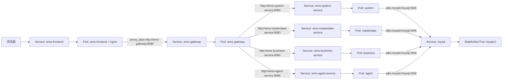

# Kubernetes Service 发现与 WMS 全链路调用指南

更新时间：2026-06-29

项目路径：

```text
D:\projects\wms-springcloud
```

本文回答四个问题：

1. 本地为什么可以通过 Eureka/`lb://` 发现服务。
2. Kubernetes 部署后为什么改为通过 Service 名称访问。
3. 浏览器、前端 nginx、网关、后端服务、MySQL 的完整链路是什么。
4. Kubernetes 给 Pod 配置了什么，使 Pod 可以用 Service 名称访问别人。

## 1. 总体结论

WMS 当前保留 `wms-discovery`，本地开发时可以继续使用 Eureka 和 Spring Cloud LoadBalancer。但在 Kubernetes 部署模式下，业务流量主要通过 Kubernetes Service DNS 转发，不再依赖 Eureka 做服务发现。

关键切换点有两个文件：

```text
D:\projects\wms-springcloud\wms-gateway\src\main\resources\application.yml
D:\projects\wms-springcloud\deploy\helm\wms\templates\gateway.yaml
```

网关应用配置里写的是“环境变量优先，否则走默认 `lb://`”：

```yaml
uri: ${WMS_SYSTEM_SERVICE_URI:lb://wms-system-service}
uri: ${WMS_MASTERDATA_SERVICE_URI:lb://wms-masterdata-service}
uri: ${WMS_BUSINESS_SERVICE_URI:lb://wms-business-service}
uri: ${WMS_AGENT_SERVICE_URI:lb://wms-agent-service}
```

Helm 部署时，`gateway.yaml` 给网关注入 Kubernetes Service 地址：

```yaml
- name: EUREKA_CLIENT_ENABLED
  value: "false"
- name: WMS_SYSTEM_SERVICE_URI
  value: http://wms-system-service:8082
- name: WMS_MASTERDATA_SERVICE_URI
  value: http://wms-masterdata-service:8083
- name: WMS_BUSINESS_SERVICE_URI
  value: http://wms-business-service:8084
- name: WMS_AGENT_SERVICE_URI
  value: http://wms-agent-service:8085
```

所以 Kubernetes 下网关最终不会用 `lb://wms-system-service`，而是直接请求：

```text
http://wms-system-service:8082
http://wms-masterdata-service:8083
http://wms-business-service:8084
http://wms-agent-service:8085
```

这不是写死 Pod IP，而是访问 Kubernetes Service 名称。Pod 重启、扩容、IP 变化时，Service 名称仍然稳定。

## 2. 本地模式和 Kubernetes 模式的区别

### 2.1 本地模式

本地服务配置保留 Eureka 地址：

```text
wms-gateway/src/main/resources/application.yml
wms-system-service/src/main/resources/application.yml
wms-masterdata-service/src/main/resources/application.yml
wms-business-service/src/main/resources/application.yml
wms-agent-service/src/main/resources/application.yml
```

链路是：

```text
服务启动
  -> 注册到 Eureka
  -> 网关使用 lb://服务名
  -> Spring Cloud LoadBalancer 选择实例
  -> 转发 HTTP 请求
```

本地适合这样做，因为所有服务都跑在开发机端口上，Eureka 页面也方便观察服务注册状态。

### 2.2 Kubernetes 模式

Kubernetes 中，Helm 给服务注入：

```text
EUREKA_CLIENT_ENABLED=false
```

Spring Boot 会把它映射为：

```yaml
eureka.client.enabled=false
```

同时网关拿到明确的 Service URL：

```text
WMS_SYSTEM_SERVICE_URI=http://wms-system-service:8082
WMS_MASTERDATA_SERVICE_URI=http://wms-masterdata-service:8083
WMS_BUSINESS_SERVICE_URI=http://wms-business-service:8084
WMS_AGENT_SERVICE_URI=http://wms-agent-service:8085
```

链路变成：

```text
Pod 启动
  -> Service 根据 selector 找到 Pod
  -> CoreDNS 解析 Service 名称
  -> 网关通过 HTTP 请求 Service 名称
  -> Service 负载转发到后端 Pod
```

## 3. 网关当前路由表

实际路由文件：

```text
D:\projects\wms-springcloud\wms-gateway\src\main\resources\application.yml
```

Kubernetes 下最终等价于：

```text
/api/auth/**           -> http://wms-system-service:8082
/api/menus/**          -> http://wms-system-service:8082
/api/users/**          -> http://wms-system-service:8082
/api/roles/**          -> http://wms-system-service:8082
/api/config-items/**   -> http://wms-system-service:8082

/api/suppliers/**      -> http://wms-masterdata-service:8083
/api/customers/**      -> http://wms-masterdata-service:8083
/api/equipment/**      -> http://wms-masterdata-service:8083
/api/parts/**          -> http://wms-masterdata-service:8083
/api/locations/**      -> http://wms-masterdata-service:8083

/api/inbound-orders/**  -> http://wms-business-service:8084
/api/outbound-orders/** -> http://wms-business-service:8084
/api/kanbans/**         -> http://wms-business-service:8084
/api/inventory/**       -> http://wms-business-service:8084
/api/mobile/scan/**     -> http://wms-business-service:8084

/api/agent/**           -> http://wms-agent-service:8085
```

Agent 是旁路服务。`/api/agent/**` 失败时，只影响智能助手页面，不应该影响入库、出库、库存、看板等主业务。

## 4. Kubernetes 为什么能通过 Service 名称访问

以 `wms-system-service` 为例，Helm 模板创建了 Service 和 Deployment。

文件：

```text
D:\projects\wms-springcloud\deploy\helm\wms\templates\system-service.yaml
```

Service：

```yaml
apiVersion: v1
kind: Service
metadata:
  name: wms-system-service
spec:
  ports:
    - name: http
      port: 8082
      targetPort: 8082
  selector:
    app: wms-system-service
```

Deployment 的 Pod label：

```yaml
template:
  metadata:
    labels:
      app: wms-system-service
```

Kubernetes 会做这些事：

1. Service 用 selector `app=wms-system-service` 找到匹配 Pod。
2. EndpointSlice 记录这些 Pod IP 和端口。
3. CoreDNS 为 Service 创建 DNS 名称。
4. Pod 内的 `/etc/resolv.conf` 写入 nameserver 和 search domain。
5. 同 namespace 下，Pod 访问短名称 `wms-system-service`，会自动补全成类似：

```text
wms-system-service.wms.svc.cluster.local
```

6. kube-proxy 或 CNI 把发往 Service 虚拟 IP 的流量转发到真实 Pod IP。

所以访问：

```text
http://wms-system-service:8082
```

访问的是 Service，而不是某一个固定 Pod。

## 5. Kubernetes 会给 Pod 配置什么

### 5.1 DNS 配置

查看网关 Pod 的 DNS 配置：

```powershell
kubectl exec -n wms deploy/wms-gateway -- cat /etc/resolv.conf
```

通常会看到：

```text
nameserver 10.x.x.x
search wms.svc.cluster.local svc.cluster.local cluster.local
options ndots:5
```

`search wms.svc.cluster.local` 让 Pod 可以直接使用短名称：

```text
wms-gateway
wms-system-service
wms-masterdata-service
wms-business-service
wms-agent-service
mysql
```

### 5.2 Service 环境变量

Kubernetes 也会自动注入 Service 相关环境变量，例如：

```text
MYSQL_SERVICE_HOST
MYSQL_SERVICE_PORT
WMS_GATEWAY_SERVICE_HOST
WMS_GATEWAY_SERVICE_PORT
```

但本项目不依赖这些自动变量做业务路由。项目采用更明确的 Helm 环境变量：

```text
WMS_SYSTEM_SERVICE_URI=http://wms-system-service:8082
DB_URL=jdbc:mysql://mysql:3306/wms_cloud...
```

这样更容易检查和排障。

### 5.3 Secret 注入

文件：

```text
D:\projects\wms-springcloud\deploy\helm\wms\templates\secret.yaml
```

服务通过 Secret 读取数据库账号密码：

```yaml
- name: DB_USERNAME
  valueFrom:
    secretKeyRef:
      name: wms-mysql-secret
      key: username
- name: DB_PASSWORD
  valueFrom:
    secretKeyRef:
      name: wms-mysql-secret
      key: password
```

### 5.4 ConfigMap 注入 SQL

初始化 SQL 来源：

```text
D:\projects\wms-springcloud\deploy\helm\wms\files\wms-cloud-init.sql
```

ConfigMap 模板：

```text
D:\projects\wms-springcloud\deploy\helm\wms\templates\mysql-init-configmap.yaml
```

MySQL 容器和 `wms-mysql-init` Job 都使用这份 SQL。

## 6. 前端到后端的完整链路

### 6.1 浏览器访问前端

Helm 文件：

```text
D:\projects\wms-springcloud\deploy\helm\wms\templates\frontend.yaml
```

默认 NodePort：

```text
http://<NodeIP>:30081
```

如果启用 Ingress，则浏览器访问域名：

```text
https://你的域名
```

### 6.2 前端 API 使用同源 `/api`

前端 API 基础地址：

```text
D:\projects\wms-springcloud\frontend\src\api\client.ts
```

部署镜像构建时注入：

```text
VITE_API_BASE=/api
```

因此浏览器访问前端后，请求是同源：

```text
http://<NodeIP>:30081/api/auth/login
```

浏览器不能解析 `wms-gateway` 这种 Kubernetes 内部 Service 名称。解析发生在前端 nginx Pod 内部。

### 6.3 前端 nginx 转发到网关 Service

文件：

```text
D:\projects\wms-springcloud\deploy\docker\nginx.conf
```

关键配置：

```nginx
location /api/ {
  proxy_pass http://wms-gateway:8080/api/;
}
```

链路：

```text
浏览器请求 /api/auth/login
  -> 前端 nginx 收到请求
  -> nginx 在 Pod 内解析 wms-gateway
  -> 转发到 http://wms-gateway:8080/api/auth/login
```

### 6.4 网关转发到后端服务

完整登录链路：

```text
浏览器
  -> http://<NodeIP>:30081/api/auth/login
  -> wms-frontend Pod 内 nginx
  -> http://wms-gateway:8080/api/auth/login
  -> wms-gateway Pod
  -> http://wms-system-service:8082/api/auth/login
  -> wms-system-service Pod
  -> jdbc:mysql://mysql:3306/wms_cloud
```

Agent 页面链路：

```text
浏览器
  -> /api/agent/dashboard?days=30
  -> wms-frontend nginx
  -> wms-gateway
  -> http://wms-agent-service:8085/api/agent/dashboard?days=30
  -> wms-agent-service Pod
  -> jdbc:mysql://mysql:3306/wms_cloud
```

## 7. 后端访问 MySQL 的链路

MySQL Service 模板：

```text
D:\projects\wms-springcloud\deploy\helm\wms\templates\mysql.yaml
```

数据库 URL helper：

```text
D:\projects\wms-springcloud\deploy\helm\wms\templates\_helpers.tpl
```

关键模板：

```gotemplate
{{- define "wms.dbUrl" -}}
{{- printf "jdbc:mysql://mysql:3306/%s?useUnicode=true&characterEncoding=utf8&serverTimezone=Asia/Shanghai&allowPublicKeyRetrieval=true&useSSL=false" .Values.mysql.database -}}
{{- end -}}
```

服务中注入：

```yaml
- name: DB_URL
  value: {{ include "wms.dbUrl" . | quote }}
```

所以 Kubernetes 中实际连接：

```text
jdbc:mysql://mysql:3306/wms_cloud
```

这里的 `mysql` 也是 Kubernetes Service 名称。

## 8. 数据库初始化做了什么

SQL 文件：

```text
D:\projects\wms-springcloud\deploy\helm\wms\files\wms-cloud-init.sql
```

Job 文件：

```text
D:\projects\wms-springcloud\deploy\helm\wms\templates\mysql-init-job.yaml
```

Job 逻辑：

```sh
until mysqladmin ping -hmysql -uroot -p"$MYSQL_ROOT_PASSWORD" --silent; do
  echo "waiting for mysql..."
  sleep 2
done
mysql -hmysql -uroot -p"$MYSQL_ROOT_PASSWORD" --default-character-set=utf8mb4 < /docker-entrypoint-initdb.d/wms-cloud-init.sql
```

关键点：

- `-hmysql` 连接 MySQL Service，不是 Pod IP。
- `--default-character-set=utf8mb4` 避免中文导入乱码。
- SQL 幂等执行，只补结构和系统基础数据。
- SQL 不写入供应商、客户、零件、入库、出库、库存、看板等业务演示数据。
- SQL 包含 `agent_*` 表和 Agent 菜单。

## 9. GitHub Actions 部署链路

工作流文件：

```text
D:\projects\wms-springcloud\.github\workflows\build-and-push-images.yml
```

推送 `master` 后：

1. 用 `GITHUB_RUN_NUMBER` 生成版本号，例如 `v34`。
2. 构建并推送镜像：

```text
wms-discovery-v34
wms-gateway-v34
wms-system-service-v34
wms-masterdata-service-v34
wms-business-service-v34
wms-agent-service-v34
wms-frontend-v34
```

3. 把 `mysql:8.0` mirror 到 ACR：

```text
wms-mysql-8.0
```

4. SSH 到服务器，设置：

```bash
export KUBECONFIG=/etc/rancher/k3s/k3s.yaml
```

5. 上传 Helm Chart，执行 `helm lint` 和 `helm upgrade --install`。
6. 等待 MySQL、初始化 Job、Discovery、Gateway、System、Masterdata、Business、Agent、Frontend 全部 Ready。

当前 Helm 命令不再使用旧的 `--server-side` 或 `--force-conflicts` 参数。

## 10. 当前资源关系图



## 11. 验证命令

### 11.1 查看 Pod、Service 和 Endpoint

```powershell
kubectl get pods -n wms -o wide
kubectl get svc -n wms -o wide
kubectl get endpoints -n wms wms-discovery wms-gateway wms-system-service wms-masterdata-service wms-business-service wms-agent-service mysql -o wide
```

预期：

```text
mysql-0                    1/1 Running
wms-discovery              1/1 Running
wms-gateway                1/1 Running
wms-system-service         1/1 Running
wms-masterdata-service     1/1 Running
wms-business-service       1/1 Running
wms-agent-service          1/1 Running
wms-frontend               1/1 Running
wms-mysql-init             Completed
```

### 11.2 验证网关环境变量

```powershell
kubectl exec -n wms deploy/wms-gateway -- sh -c "printenv | grep -E 'EUREKA_CLIENT_ENABLED|WMS_.*SERVICE_URI'"
```

预期：

```text
EUREKA_CLIENT_ENABLED=false
WMS_SYSTEM_SERVICE_URI=http://wms-system-service:8082
WMS_MASTERDATA_SERVICE_URI=http://wms-masterdata-service:8083
WMS_BUSINESS_SERVICE_URI=http://wms-business-service:8084
WMS_AGENT_SERVICE_URI=http://wms-agent-service:8085
```

### 11.3 验证前端 Pod 到网关

```powershell
kubectl exec -n wms deploy/wms-frontend -- sh -c "wget -S -qO- http://wms-gateway:8080/api/menus 2>&1 | head -20"
```

返回 `401 Unauthorized` 不代表链路失败，它说明请求已经到达后端鉴权逻辑。

### 11.4 验证登录和 Agent

```powershell
$body = @{
  username = 'admin'
  password = 'admin123'
} | ConvertTo-Json

$login = Invoke-RestMethod 'http://127.0.0.1:30081/api/auth/login' `
  -Method Post `
  -ContentType 'application/json' `
  -Body $body

$headers = @{ Authorization = "Bearer $($login.data.token)" }

Invoke-RestMethod 'http://127.0.0.1:30081/api/auth/me' -Headers $headers
Invoke-RestMethod 'http://127.0.0.1:30081/api/agent/health' -Headers $headers
Invoke-RestMethod 'http://127.0.0.1:30081/api/agent/dashboard?days=30' -Headers $headers
```

### 11.5 验证数据库初始化

```powershell
kubectl exec -n wms mysql-0 -- mysql -uroot -proot123456 -D wms_cloud -e "SELECT COUNT(*) AS app_user_count FROM app_user; SELECT COUNT(*) AS menu_item_count FROM menu_item; SELECT COUNT(*) AS agent_table_count FROM information_schema.tables WHERE table_schema='wms_cloud' AND table_name LIKE 'agent\_%';"
```

## 12. 日志检查命令

网关：

```powershell
kubectl logs -n wms deploy/wms-gateway --tail=180
```

业务服务：

```powershell
kubectl logs -n wms deploy/wms-system-service --tail=180
kubectl logs -n wms deploy/wms-masterdata-service --tail=180
kubectl logs -n wms deploy/wms-business-service --tail=180
kubectl logs -n wms deploy/wms-agent-service --tail=180
```

前端 nginx：

```powershell
kubectl logs -n wms deploy/wms-frontend --tail=180
```

MySQL 初始化：

```powershell
kubectl logs -n wms job/wms-mysql-init --tail=120
```

## 13. 常见问题

### 13.1 为什么浏览器打不开 `http://wms-gateway:8080`

`wms-gateway` 是 Kubernetes 集群内部 DNS 名称，只能在 Pod 内解析。浏览器应该访问：

```text
http://服务器IP:30081
http://服务器IP:30080/api
```

或访问 Ingress 域名。

### 13.2 为什么 `/api/menus` 返回 401

没带 `Authorization: Bearer token` 时返回 401 是正常鉴权结果。它反而说明请求已经到达网关和系统服务。

链路故障通常是：

```text
Connection refused
Name or service not known
502 Bad Gateway
503 Service Unavailable
504 Gateway Timeout
```

### 13.3 为什么 gateway 以前会连 Eureka 报错

如果 Kubernetes 没有注入：

```text
EUREKA_CLIENT_ENABLED=false
WMS_SYSTEM_SERVICE_URI=http://wms-system-service:8082
```

网关就会退回默认 `lb://服务名`，从而依赖 Eureka 或 LoadBalancer 的实例列表。Eureka 不可达或实例未注册时，就会出现连接失败。

### 13.4 为什么数据库 Pod Running 但系统没数据

Pod Running 只表示 MySQL 进程启动，不代表 SQL 已执行。需要看：

```powershell
kubectl get job -n wms
kubectl logs -n wms job/wms-mysql-init --tail=120
kubectl exec -n wms mysql-0 -- mysql -uroot -proot123456 -D wms_cloud -e "SELECT COUNT(*) FROM app_user;"
```

### 13.5 为什么 MySQL 镜像拉取慢

当前工作流会把 `mysql:8.0` mirror 到 ACR，并让 Helm 使用：

```text
crpi-i0bdeprulhtq3581.cn-guangzhou.personal.cr.aliyuncs.com/fuliang-hub/wms-cloud:wms-mysql-8.0
```

如果仍然慢，检查节点到 ACR 的网络、镜像拉取 Secret 和镜像 tag 是否存在。

## 14. 关键记忆

```text
外部访问 NodePort 或 Ingress
集群内部访问 Service DNS 名称
网关负责业务 HTTP 路由
数据库通过 mysql Service 访问
Agent 是旁路服务，不影响主业务
Eureka 保留给本地开发或观察，不作为 Kubernetes 业务流量核心依赖
```

同一份网关配置支持两种模式：

```text
本地未注入环境变量 -> 默认 lb://，走 Spring Cloud 服务发现
Kubernetes 注入环境变量 -> 使用 http://ServiceName:Port，走 Kubernetes Service DNS
```